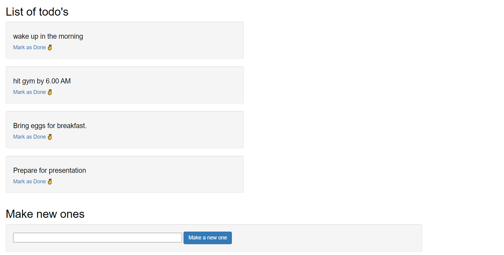
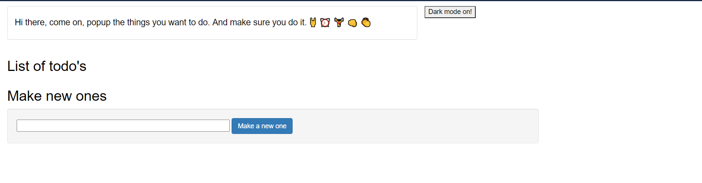

# Mini-project-blog-codes
This repository contains all the codes related to all the blogs that have been written by me.

1. **To Do** app in Python-Django:
	1. A simple todo application written in django. The idea is simple, we have a two field model which has text description of the task to be done and a boolean field which keeps the status of the task. If the status of the task is false, then the task is marked as not done else it is done.
	2. Undone tasks are filtered by their status and are sent to the user.
	3. The user can add new task, mark a task as done and view all the undone tasks.
Some of the screens of the app are attached below.

For more detailed explanation, please go through [this](https://medium.com/python-in-plain-english/how-to-make-a-simple-to-do-app-in-python-django-ead5b35b9d98) blog

The end to end demo of the application is shown in [this](https://www.youtube.com/watch?v=oSHDhhNu6WI) video.
