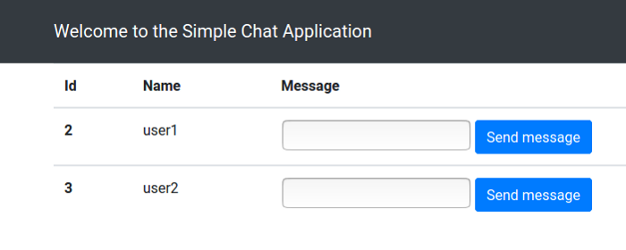
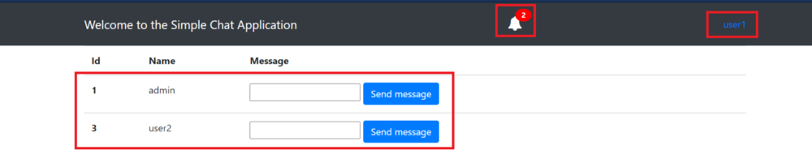
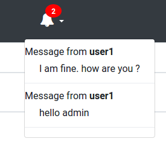

# Mini-project-blog-codes
This repository contains all the codes related to all the blogs that have been written by me.

1. **To Do** app in Python-Django:
	1. A simple todo application written in django. The idea is simple, we have a two field model which has text description of the task to be done and a boolean field which keeps the status of the task. If the status of the task is false, then the task is marked as not done else it is done.
	2. Undone tasks are filtered by their status and are sent to the user.
	3. The user can add new task, mark a task as done and view all the undone tasks.
Some of the screens of the app are attached below.

For more detailed explanation, please go through [this](https://medium.com/python-in-plain-english/how-to-make-a-simple-to-do-app-in-python-django-ead5b35b9d98) blog

The end to end demo of the application is shown in [this](https://www.youtube.com/watch?v=oSHDhhNu6WI) video.

2.  #### How to add notifications to a django powered application.
The idea is simple, to use python-django-notifications-hq package and use them in our django powered application.

A blog has been written in medium explaining how to add to django project and [this](https://medium.com/star-gazers/how-to-add-notifications-to-django-app-74df1dac984e) is the link to the article.

Few sample screens of the app are attached here.

Any doubts, clarifications, suggestions or improvements, please contact me or leave a comment.
Thanks, cheers :v:
